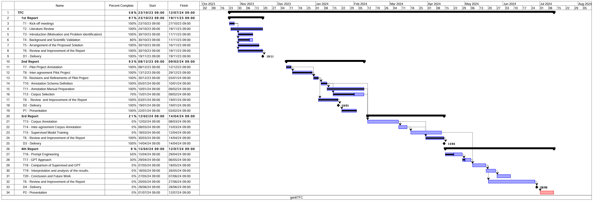

# DEISI89
*A GPT-Based Data Augmentation Approach for enhancing Argumentation Mining in Multi-party Dialogues*

**Author:** Luiza Vidal Copolillo Coelho.

**Advisors:** Professors Zuil Pirola and Manuel Pita.

## Abstract
This Undergraduate Thesis proposes developing a pipeline for using GPT technology to mine arguments in online chat texts. The central point lies in the design and implementation of a system that takes advantage of GPT's advanced capabilities to identify and analyze arguments present in virtual, multi-party dialogues. The methodology ranges from data collection and preparation to efficient integration with the GPT model, providing valuable insights into the structure and dynamics of the arguments present in these online interactions. This work aims to contribute significantly to the advancement of research around argument mining by analyzing the potential of GPT technology as an effective tool in this context.

## Calendar


## Additional Notes
- The data under analysis is part of a broader project, which is the reason for its lack of public availability. For this reason, **the code cloned by people unrelated to the project may not work for now**.
- All versions of the Annotation Manual will be available soon in the *Annexes* folder.
- **Annotator 1:** Luiza Coelho; **Annotator 2:** Zuil Pirola.


## Introduction
This repository contains the code that is being used to extract, model and analyze the data that is being annotated. As previously mentioned, the data will not be available in its entirety. Only the *.ann** files generated by BRAT will be available.

*In BRAT, annotations are saved independently from the primary content using the standoff format called ANI. Each document within the system is associated with an ANN file, which is categorized into various types including general, text-bound, entity, event, relation, attribute, modification, normalization, and note-based annotations. This method ensures clear sorting and detailed classification of annotations. (https://filext.com/file-extension/ANN)

In the Pilot Annotation phase, we selected 5 rooms, each one with different topics.With the rooms duly annotated, we set about evaluating this pilot annotation with the aim of achieving **ɑ >= 0.7.** Once this result has been achieved, we will expand the corpus to carry out the main annotation.

## Inter-Annotator Agreement (IAA)
*Krippendorff's Alpha (ɑ) by Klaus Krippendorff*

In this code, we used the implementation 'Fast Krippendoff' by Santiago Castro to to assess the reliability of the annotations. 
- **GitHub Repository:** https://github.com/pln-fing-udelar/fast-krippendorff

## Dependencies

Below is a list of dependencies required to run the project, as specified in the `requirements.txt` file:

| Package        | Version |
|----------------|---------|
| scikit-learn   | 1.1.3   |
| krippendorff   | Latest  |
| matplotlib     | 3.6.3   |
| numpy          | 1.24.0  |
| json5          | 0.9.8   | 
| openai         | Latest  |  
| pandas         | 1.5.3   | 

## Installation Guide

Follow these instructions to set up and run the project locally on your machine.

### Prerequisites

- Python 3.8 or higher
- git (for cloning the repository)

### 1. Clone the Repository

First, clone the repository to your local machine using the following command:

```bash
git clone https://github.com/DEISI-ULHT-TFC-2023-24/TFC-DEISI89-GPTArgMine.git
cd repository
```

### 2. Set up a Virtual Environment

It's recommended to use a virtual environment to isolate package dependencies. To create a virtual environment in the project directory, run:

```bash
python -m venv env
```

Activate the virtual environment:
- On Windows:
```bash
.\env\Scripts\activate
```

- On Linux or macOS
```bash
source env/bin/activate
```
### 3. Install Dependecies

With the virtual environment activated, install dependencies:
```bash
pip install -r requirements.txt
```

### 4. Run the Project

Now, you're ready to run the project.

In [VSCode](https://code.visualstudio.com/download), select 'Run All' to execute the scripts at once. Or, select the 'Run' button next to each of the scripts to execute them individually.

### 5. Deactivate the Virtual Environment

When you're done working on the project, you can deactivate the virtual environment by simply running:

```bash
deactivate
```
